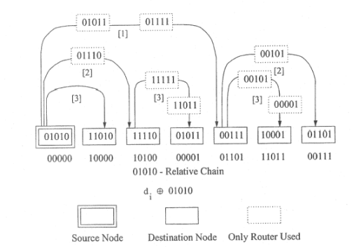
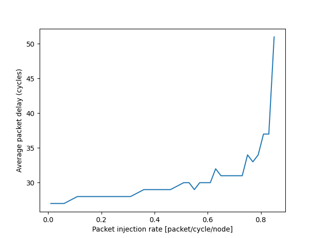
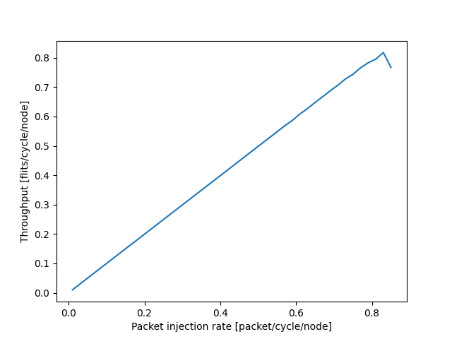

# 高性能大作业实验报告

> 姓名：邱云中
>
> 学号：2024213716
---
## 实验题目
基于单播的多播超立方体路由（Unicast-Based-Multicast-for-Hypercubes）

首先复习一下清华大学软件学院向东老师课件“集合通信 3”中关于超立方体多播路由算法的描述：(Page 58-60)
- A sequence $d_1, d_2, \cdots, d_{m-1}$ of hypercube addresses is called a $d_0$-relative dimension-ordered chain if and only if $d_0 \oplus d_1, d_0 \oplus d_2, \cdots, d_0 \oplus d_{m-1} $.
- The chain algorithm can be applied to the new address sequence.
- A multicast communication in a 5-cube from the source 01010, and destinations {00111, 10100, 11101, 10010, 00001, 00000}.



课件内容明确地指出了超立方体多播路由的底层逻辑，即通过节点 id 的异或判定路由链路。那么什么是基于单播的多播超立方体路由呢？我的理解是在确定了多播路由起点与若干终点后，使用单播的方式进行连接。从实现方法上看，可以使用树形结构模拟这一过程，先构建多播树，再基于维度顺序进行路由搜索。

---
## 实验复现
我的实验环境如下：
- Apple MacbookPro M3
- CLion IDE
- C++ 20

本项目使用 CMake 编译运行。启动实验前，请保证 CMakeLists.txt 文件存在并配置正确。以下是我使用的 CMake 配置，仅供参考：
```cmake
cmake_minimum_required(VERSION 3.25)
project(unicast-based-multicast-hypercube)

set(CMAKE_CXX_STANDARD 20)
set(CMAKE_CXX_STANDARD_REQUIRED ON)

add_executable(Simulator
        main.cpp
        Event.cpp
        Hypercube.cpp
        HypercubeNode.cpp
        HypercubeRouting.cpp
        testfuc.cpp
        )
```
---

## 实验结果

### 程序运行结果
程序运行结果如下：在注入率达到 0.85 时出现饱和点（每次运行可能模拟结果有些许不同）。
```text
/Users/qiuyz24/CLionProjects/unicast-based-multicast-hypercubes/cmake-build-debug/Simulator


linkrate:0.01    arrive:  100    in the network : 0
average latency: 27  nomalized accepted traffic: 0.01


linkrate:0.06    arrive:  599    in the network : 1
average latency: 27  nomalized accepted traffic: 0.0599


linkrate:0.11    arrive:  1098    in the network : 2
average latency: 28  nomalized accepted traffic: 0.1098


linkrate:0.16    arrive:  1596    in the network : 4
average latency: 28  nomalized accepted traffic: 0.1596


linkrate:0.21    arrive:  2094    in the network : 7
average latency: 28  nomalized accepted traffic: 0.2093


linkrate:0.26    arrive:  2593    in the network : 8
average latency: 28  nomalized accepted traffic: 0.2592


linkrate:0.31    arrive:  3092    in the network : 9
average latency: 28  nomalized accepted traffic: 0.3091


linkrate:0.36    arrive:  3590    in the network : 12
average latency: 29  nomalized accepted traffic: 0.3589


linkrate:0.41    arrive:  4087    in the network : 14
average latency: 29  nomalized accepted traffic: 0.4086


linkrate:0.46    arrive:  4587    in the network : 15
average latency: 29  nomalized accepted traffic: 0.4586


linkrate:0.51    arrive:  5085    in the network : 15
average latency: 30  nomalized accepted traffic: 0.5085


linkrate:0.53    arrive:  5283    in the network : 17
average latency: 30  nomalized accepted traffic: 0.5283


linkrate:0.55    arrive:  5482    in the network : 19
average latency: 29  nomalized accepted traffic: 0.5481


linkrate:0.57    arrive:  5684    in the network : 17
average latency: 30  nomalized accepted traffic: 0.5684


linkrate:0.59    arrive:  5866    in the network : 35
average latency: 30  nomalized accepted traffic: 0.586501


linkrate:0.61    arrive:  6084    in the network : 18
average latency: 30  nomalized accepted traffic: 0.6084


linkrate:0.63    arrive:  6269    in the network : 31
average latency: 32  nomalized accepted traffic: 0.6269


linkrate:0.65    arrive:  6477    in the network : 24
average latency: 31  nomalized accepted traffic: 0.6477


linkrate:0.67    arrive:  6672    in the network : 29
average latency: 31  nomalized accepted traffic: 0.6672


linkrate:0.69    arrive:  6876    in the network : 25
average latency: 31  nomalized accepted traffic: 0.6875


linkrate:0.71    arrive:  7065    in the network : 36
average latency: 31  nomalized accepted traffic: 0.7065


linkrate:0.73    arrive:  7276    in the network : 25
average latency: 31  nomalized accepted traffic: 0.7276


linkrate:0.75    arrive:  7435    in the network : 66
average latency: 34  nomalized accepted traffic: 0.7435


linkrate:0.77    arrive:  7657    in the network : 43
average latency: 33  nomalized accepted traffic: 0.7657


linkrate:0.79    arrive:  7829    in the network : 71
average latency: 34  nomalized accepted traffic: 0.7829


linkrate:0.81    arrive:  7951    in the network : 150
average latency: 37  nomalized accepted traffic: 0.7951


linkrate:0.83    arrive:  8177    in the network : 125
average latency: 37  nomalized accepted traffic: 0.8177


linkrate:0.85    arrive:  7673    in the network : 827
average latency: 51  nomalized accepted traffic: 0.7673

Saturation point, drain.......
in the network:      827

Process finished with exit code 1
```
### 可视化结果
平均延时结果可视化结果如下：



吞吐量可视化结果如下：


---

## 实验细节
### 网络结构设计：
- 使用 `Hypercube` 类表示超立方体网络结构，通过 `dimension` 参数定义维度
- 每个节点通过 `HypercubeNode` 类实现，包含：
    - 节点坐标（`coordinate`）
    - 缓冲区管理（`Buffer` 类）
    - 虚拟通道支持（`r1`、`r2` 缓冲区）

### 路由机制：
- 在 `HypercubeRouting` 类中实现路由算法：
    - `find_path()`: 计算源节点到目的节点的路由路径
    - `get_neighbors()`: 获取节点的邻居节点
    - `build_multicast_tree()`: 构建多播树
    - `forward_message()`: 实现消息转发

#### 多播树构建 (`build_multicast_tree`):
```cpp
void HypercubeRouting::build_multicast_tree(int source, const vector<int>& destinations) {
    // 清空现有的多播路由表
    multicast_routes.clear();
    
    // 为每个目的节点构建单播路径
    for (int dest : destinations) {
        vector<NodeInfo> path = find_path(source, dest);
        multicast_routes[dest] = path;
    }
}
```
1. 以源节点为根节点
2. 对每个目的节点：
    - 使用 `find_path` 计算从源节点到该目的节点的路径
    - 将路径存储在 `multicast_routes` 映射中
3. 最终形成一棵以源节点为根的多播树

#### 单播路径寻找 (`find_path`):
```cpp
vector<NodeInfo> HypercubeRouting::find_path(int source, int dest) {
    vector<NodeInfo> path;
    int current = source;
    
    // 获取源节点和目的节点的坐标
    vector<int> source_coord = hypercube->get_node_coordinate(source);
    vector<int> dest_coord = hypercube->get_node_coordinate(dest);
    
    // 逐维进行路由
    for (int dim = 0; dim < dimension; dim++) {
        if (source_coord[dim] != dest_coord[dim]) {
            // 在当前维度上需要改变
            int next = get_neighbor(current, dim);
            
            // 创建路由信息
            NodeInfo info;
            info.node = next;
            info.channel = dim;
            info.buff = hypercube->get_node(next)->get_buffer(dim);
            
            path.push_back(info);
            current = next;
        }
    }
    
    return path;
}
```

1. 基于维度顺序路由（Dimension Order Routing）：
    - 从低维到高维依次检查每个维度
    - 如果源节点和目的节点在某个维度上的坐标不同，则在该维度上进行路由

2. 路径构建步骤：
    - 获取源节点和目的节点的坐标
    - 逐维比较坐标差异
    - 对于需要改变的维度：
        - 计算下一跳节点
        - 创建包含节点信息、通道信息和缓冲区信息的 `NodeInfo`
        - 将信息添加到路径中

#### 邻居节点获取 (`get_neighbor`):
```cpp
int HypercubeRouting::get_neighbor(int node, int dimension) {
    // 获取节点坐标
    vector<int> coord = hypercube->get_node_coordinate(node);
    
    // 在指定维度上翻转坐标
    coord[dimension] = 1 - coord[dimension];
    
    // 将坐标转换回节点ID
    return hypercube->get_node_id(coord);
}
```

1. 获取当前节点的坐标
2. 在指定维度上翻转坐标（0变1，1变0）
3. 将新坐标转换回节点ID

#### 消息转发过程（`forward_message`）：
```cpp
void HypercubeRouting::forward_message(Message* msg) {
    // 获取消息的当前路由路径
    vector<NodeInfo>& path = multicast_routes[msg->dest];
    
    // 检查缓冲区是否可用
    if (path[msg->current_hop].buff->bufferMin()) {
        // 更新消息状态
        msg->current_hop++;
        msg->routpath[msg->current_hop] = path[msg->current_hop];
        
        // 更新缓冲区状态
        path[msg->current_hop].buff->bufferPlus();
    }
}
```

1. 根据目的节点获取对应的路由路径
2. 检查下一跳节点的缓冲区是否可用
3. 如果可用：
    - 更新消息的当前跳数
    - 更新消息的路由路径信息
    - 更新缓冲区状态


### 消息处理：
- `Message` 类表示网络中的消息：
    - 包含源节点、目的节点信息
    - 存储路由路径（`routpath`）
    - 记录消息状态（`active`、`releaselink`等）

### 事件处理：
- `Event` 类处理消息的生成和转发：
    - `genMes()`: 生成新消息
    - `forwardMes()`: 处理消息转发
    - 管理消息的生命周期

### 性能模拟：
- 在 `main.cpp` 中实现性能模拟：
    - 支持不同的流量模式（`GENERATETYPE`）
    - 可配置的缓冲区大小（`r1buffer`、`r2buffer`）
    - 统计网络性能指标（延迟、吞吐量等）


## 其他问题讨论
**Q：基于单播的多播超立方体路由饱和点是否可以避免？**

A：当将网络大小从 8 维增加到 16 维后，饱和点消失。运行结果如下：
```text
/Users/qiuyz24/CLionProjects/unicast-based-multicast-hypercubes/cmake-build-debug/Simulator


linkrate:0.01    arrive:  200    in the network : 0
average latency: 31  nomalized accepted traffic: 0.01


linkrate:0.06    arrive:  1197    in the network : 4
average latency: 31  nomalized accepted traffic: 0.0598002


linkrate:0.11    arrive:  2194    in the network : 8
average latency: 31  nomalized accepted traffic: 0.10965


linkrate:0.16    arrive:  3190    in the network : 11
average latency: 32  nomalized accepted traffic: 0.15945


linkrate:0.21    arrive:  4187    in the network : 13
average latency: 32  nomalized accepted traffic: 0.20935


linkrate:0.26    arrive:  5183    in the network : 17
average latency: 32  nomalized accepted traffic: 0.25915


linkrate:0.31    arrive:  6182    in the network : 20
average latency: 32  nomalized accepted traffic: 0.3091


linkrate:0.36    arrive:  7179    in the network : 23
average latency: 32  nomalized accepted traffic: 0.3589


linkrate:0.41    arrive:  8176    in the network : 26
average latency: 31  nomalized accepted traffic: 0.40875


linkrate:0.46    arrive:  9172    in the network : 31
average latency: 31  nomalized accepted traffic: 0.45855


linkrate:0.51    arrive:  10169    in the network : 32
average latency: 32  nomalized accepted traffic: 0.5084


linkrate:0.53    arrive:  10567    in the network : 36
average latency: 31  nomalized accepted traffic: 0.5283


linkrate:0.55    arrive:  10968    in the network : 34
average latency: 31  nomalized accepted traffic: 0.54835


linkrate:0.57    arrive:  11365    in the network : 37
average latency: 32  nomalized accepted traffic: 0.5682


linkrate:0.59    arrive:  11765    in the network : 36
average latency: 31  nomalized accepted traffic: 0.58825


linkrate:0.61    arrive:  12162    in the network : 38
average latency: 31  nomalized accepted traffic: 0.6081


linkrate:0.63    arrive:  12561    in the network : 40
average latency: 32  nomalized accepted traffic: 0.62805


linkrate:0.65    arrive:  12960    in the network : 40
average latency: 32  nomalized accepted traffic: 0.648


linkrate:0.67    arrive:  13362    in the network : 43
average latency: 32  nomalized accepted traffic: 0.6681


linkrate:0.69    arrive:  13758    in the network : 45
average latency: 32  nomalized accepted traffic: 0.6879


linkrate:0.71    arrive:  14155    in the network : 46
average latency: 32  nomalized accepted traffic: 0.70775


linkrate:0.73    arrive:  14555    in the network : 46
average latency: 31  nomalized accepted traffic: 0.72775


linkrate:0.75    arrive:  14955    in the network : 45
average latency: 31  nomalized accepted traffic: 0.74775


linkrate:0.77    arrive:  15351    in the network : 50
average latency: 32  nomalized accepted traffic: 0.76755


linkrate:0.79    arrive:  15751    in the network : 50
average latency: 32  nomalized accepted traffic: 0.78755


linkrate:0.81    arrive:  16150    in the network : 52
average latency: 32  nomalized accepted traffic: 0.8075


linkrate:0.83    arrive:  16548    in the network : 54
average latency: 32  nomalized accepted traffic: 0.8274


linkrate:0.85    arrive:  16947    in the network : 55
average latency: 32  nomalized accepted traffic: 0.84735


linkrate:0.87    arrive:  17349    in the network : 51
average latency: 31  nomalized accepted traffic: 0.86745


linkrate:0.89    arrive:  17749    in the network : 56
average latency: 32  nomalized accepted traffic: 0.88745


linkrate:0.91    arrive:  18144    in the network : 58
average latency: 32  nomalized accepted traffic: 0.9072


linkrate:0.93    arrive:  18543    in the network : 60
average latency: 32  nomalized accepted traffic: 0.92715


linkrate:0.95    arrive:  18943    in the network : 58
average latency: 31  nomalized accepted traffic: 0.94715


linkrate:0.97    arrive:  19342    in the network : 61
average latency: 32  nomalized accepted traffic: 0.9671


linkrate:0.99    arrive:  19739    in the network : 64
average latency: 31  nomalized accepted traffic: 0.98695


Process finished with exit code 1

```